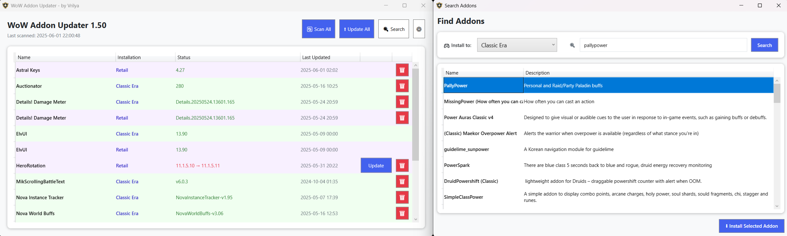

# WoW Addon Updater

A simple, lightweight tool for managing and updating addons from CurseForge for all versions of World of Warcraft (Retail/Classic/TBC/WOTLK/Cata/MoP).

## Features

- 🔄 **No Login Required**: Works without any login credentials or API keys
- 📋 **Addon Tracking**: Keeps track of installed addons
- ⬆️ **One-Click Updates**: Update all your addons with a single click
- 🔍 **Addon Search**: Search and install new addons directly from CurseForge
- ⚙️ **ElvUI Support**: Install, update, and manage ElvUI alongside your CurseForge addons
- 🗑️ **Easy Removal**: Easily remove addons you no longer use
- 💾 **Smart Version Tracking**: Keeps track of installed versions and notifies when updates are available
- 🛡️ **No Ads or Tracking**: Completely ad-free with no telemetry or user data collection
- 🔒 **Privacy First**: All data stays on your computer - nothing is sent to external servers

## Requirements

- Windows 10/11
- .NET 8.0 Runtime or later

## Installation

1. Download the latest release from the [Releases](https://github.com/vrilya/wow-addon-updater/releases) page
2. Extract it to a location of your choice
3. If you don't already have it, install the [.NET 8.0 Desktop Runtime](https://dotnet.microsoft.com/en-us/download/dotnet/thank-you/runtime-desktop-8.0.15-windows-x64-installer)
4. Run `WowAddonUpdater.exe`

## Getting Started

1. **Select Game Version**: Open Settings and choose your WoW version from the dropdown (Classic Vanilla, TBC, WOTLK, Cata, MOP, or Retail)
2. **Set Addon Path**: Browse to your WoW addons folder 
   - Example: `C:\Program Files (x86)\World of Warcraft\_classic_\Interface\AddOns`
3. **Automatic Detection**: The application will automatically detect and add your existing addons.
4. **Scan for Updates**: Click "Scan for Updates" to check for newer versions

## Usage

### Managing Addons

- **Scanning**: Click the "Scan for Updates" button to check for addon updates
- **Update All**: Click "Update All" to update all addons that have new versions available
- **Individual Updates**: Click the "Update" button next to any addon that needs updating
- **Remove Addons**: Click the trash icon to remove an addon you no longer want

### Installing New Addons

1. Click the "Search" button to open the search window
2. Enter an addon name or keywords in the search box
3. Select an addon from the results list
4. Click "Install Selected Addon" to download and install

### ElvUI Management

ElvUI is a popular complete UI replacement that isn't available on CurseForge. This tool can manage ElvUI alongside your other addons.

1. Go to Settings (⚙️)
2. Check the "Install/Uninstall ElvUI" checkbox to install ElvUI
3. ElvUI will now appear in your addon list and can be updated like any other addon

